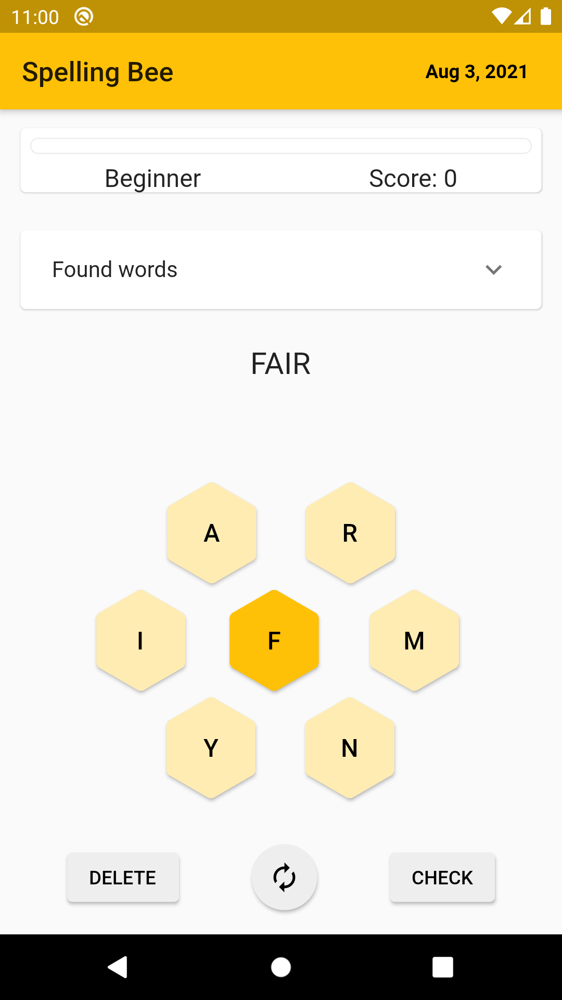
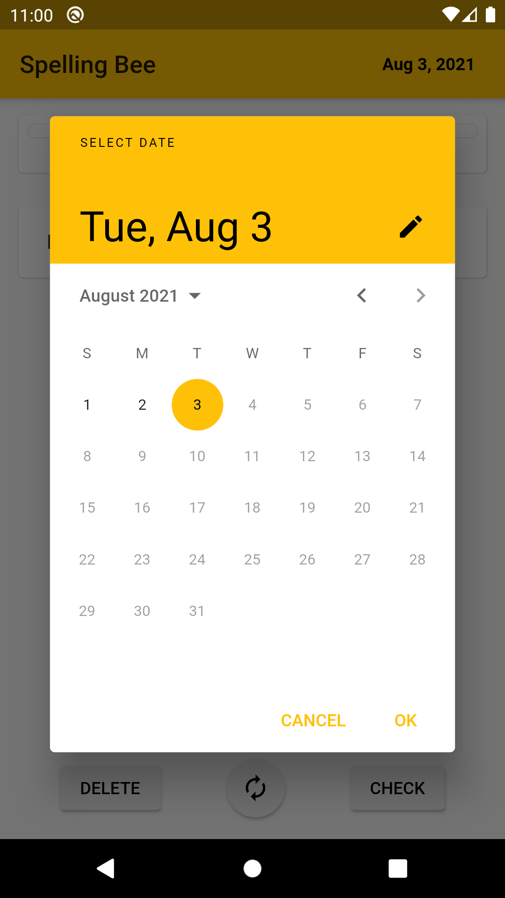
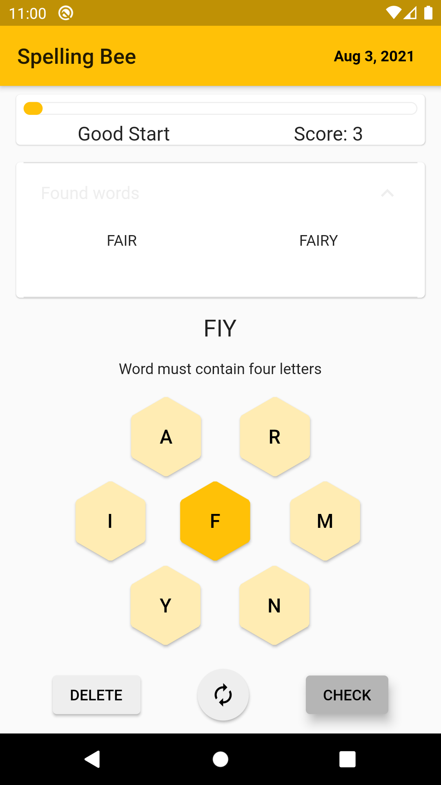

# Spelling Bee

## Author

Andreas Röckert

## About the game

Spelling Bee is a puzzle game where you want to find as many words as possible out of seven letters. Use it to test and extend your vocabulary while having fun.

The rules of the game are:

- Build words from the seven letters available
- You can reuse letters as many times as you like
- A word should contain at least four letters
- A word must contain the central letter

A longer word will award you more points, and letters that contain all letters will give you an additional bonus.

The game is a clone of the [New York Times game with the same name](https://www.nytimes.com/puzzles/spelling-bee), where a curated list of words and letters are updated each day. A complete list of the solution words of each day's puzzle is often quickly published at [nytbee.com](nytbee.com).

## Implementation

I created a clone of the game using the [Flutter SDK](https://flutter.dev/) in [Dart](https://dart.dev/). The game can be played on mobile devices (android or iOS) using one codebase. The app is a simple one-page app that shows the gameboard and selector for which day's puzzle to solve.

In the current implementation, the app makes a web request and fetches today's words from the web, or[nytbee.com](nytbee.com) to be exact. It parses the HTML response and creates an internal model of the correct words from the day. From the correct words, the app derives the letters for the gameboard and stores this information (correct words and letters) in a [persistent NoSQL database](https://pub.dev/packages/sembast) on the device. Next time you play the same day's game, the words are instead fetched from the database. Additionally, your progress is also stored in the same database, allowing you to continue at any time or select an earlier date to play.

As you play the game and find words, your progress in points and found words can be seen from the game screen. The game will also give you guidance on the rules if you make any mistakes.

## Distribution

The game is currently not distributed on any store is build for production but instead used as an educational project. If there happens to be of interest, please report it as an issue.
